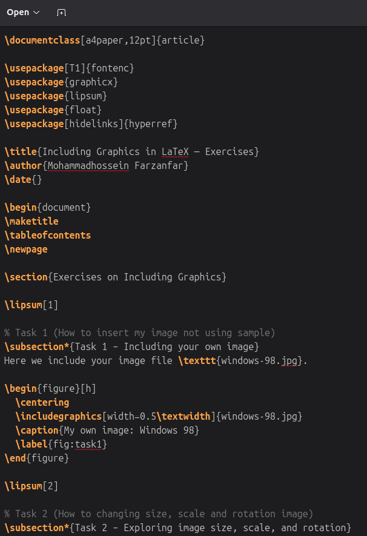
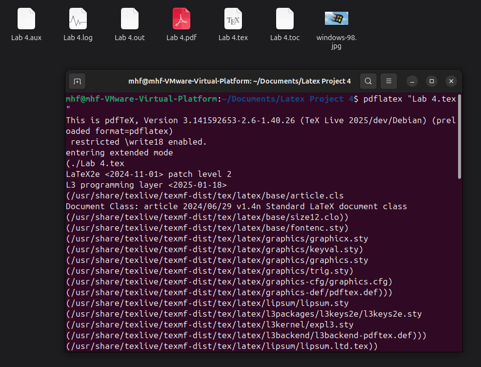
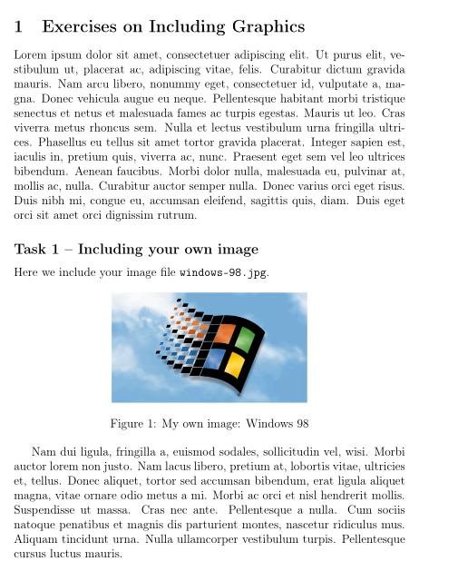
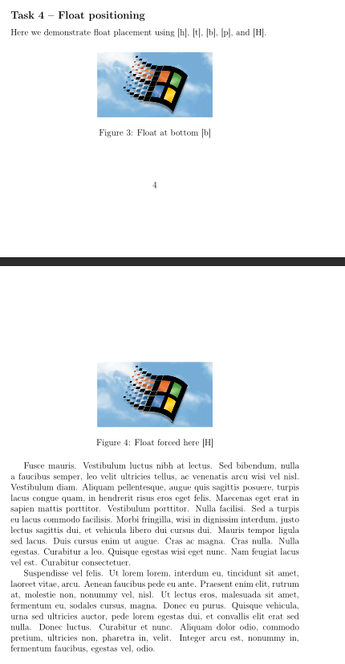
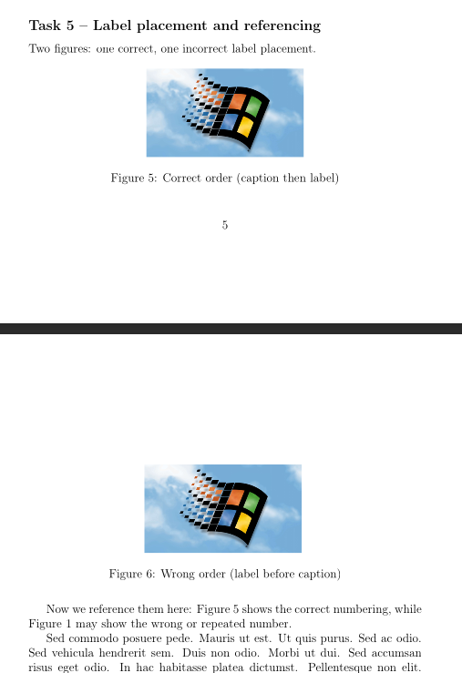

---
## Front matter
lang: ru-RU
title: "Лабораторная работа №4"
subtitle: "Дисциплина: Компьютерный практикум по научному письму"
author: "Мохаммадхоссейн Фарзанфар"
institute: "РУДН, Москва, Россия"
date: 25 Октября 2025

## Formatting
toc: true
toc_depth: 2
fontsize: 12pt
linestretch: 1.5
papersize: a4paper
documentclass: scrreprt
polyglossia-lang: russian
polyglossia-otherlangs: english
mainfont: PT Serif
romanfont: PT Serif
sansfont: PT Sans
monofont: PT Mono
mainfontoptions: Ligatures=TeX
romanfontoptions: Ligatures=TeX
sansfontoptions: Ligatures=TeX,Scale=MatchLowercase
monofontoptions: Scale=MatchLowercase
indent: true
pdf-engine: lualatex
header-includes:
  - \usepackage{float}
  - \floatplacement{figure}{H}
---

# Цель работы

Освоить работу с графикой в LaTeX: вставку изображений, изменение размера и масштаба, вращение, использование плавающих объектов и ссылок на фигуры.

# Задание

1. Вставить собственное изображение
2. Изменять размер, масштаб и угол изображения
3. Использование относительных размеров (`textwidth` и `linewidth`)
4. Демонстрировать разные варианты плавающих объектов `[h], [t], [b], [H]`
5. Использовать `caption` и `label` для ссылок на фигуры
6. Компиляция документа дважды для корректного отображения ссылок

# Выполнение лабораторной работы

## 1. Создание документа и кода

Создан файл `lab4.tex` с практическими упражнениями. Скриншоты кода:

{ width=70% }

{ width=70% }

{ width=70% }

{ width=70% }

{ width=70% }

---

## 2. Компиляция документа

Документ был скомпилирован с помощью команды:

```bash
pdflatex lab4.tex
```
## 3. Результаты по задачам
Task 1 – Вставка собственного изображения

{ width=70% }
Рисунок 1. Task 1 – PDF результат

Task 2 – Изменение размера, масштаба и угла

{ width=70% }
Рисунок 2. Task 2 – PDF результат

Task 3 – Использование относительных размеров

{ width=70% }
Рисунок 3. Task 3 – PDF результат

Примечание: Использование относительных размеров (`\textwidth` и `\linewidth`) позволяет управлять шириной изображения.

Task 4 – Плавающие объекты

{ width=70% }
Рисунок 4. Task 4 – PDF результат

Task 5 – Подписи и ссылки на фигуры

{ width=70% }
Рисунок 5. Task 5 – PDF результат

Примечание:

`\caption` должен идти до `\label` для корректной нумерации.

Если порядок обратный — возможна повторяющаяся нумерация.

Ссылки на фигуры: Figure \ref{fig:right} показывает правильный порядок, Figure \ref{fig:wrong} демонстрирует неправильный порядок.

## 4. Выводы

В ходе лабораторной работы №4 были освоены следующие навыки:

Вставка изображений и работа с их размером и масштабом

Поворот изображений под разными углами

Использование относительных размеров (textwidth и linewidth)

Работа с плавающими объектами `[h], [t], [b], [H]`

Правильное использование caption и label для ссылок

Компиляция документа дважды для корректного отображения ссылок и нумерации

Работа с графикой в LaTeX продемонстрировала возможности управления изображениями, их размещением и ссылками, что важно для подготовки научных отчетов и публикаций.
