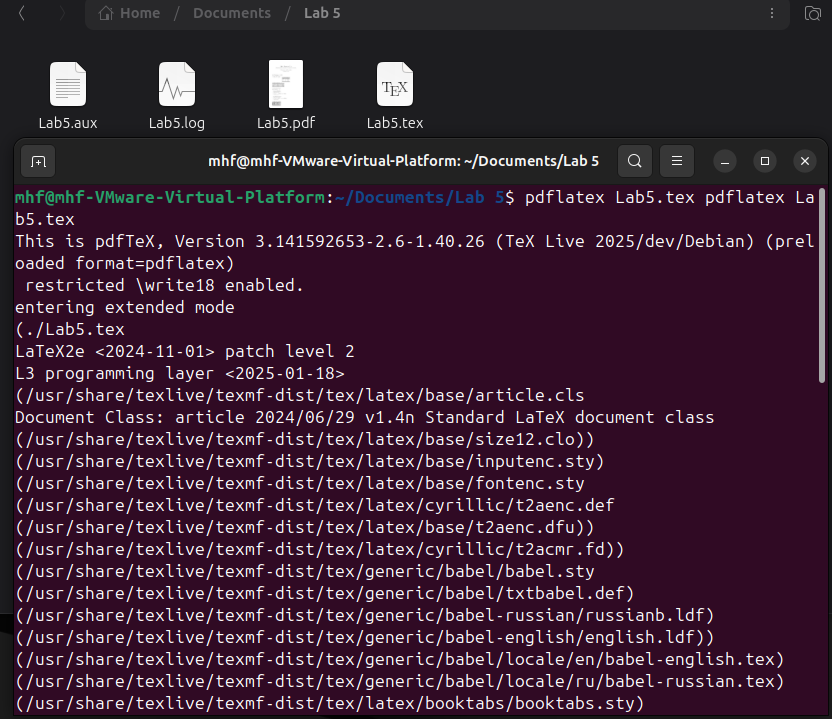

---
## Front matter
title: "Лабораторная работа №5"
subtitle: "Работа с таблицами в LaTeX"
author: "Мохаммадхоссейн Фарзанфар"
institute: "РУДН"
date: "2026"
lang: ru-RU

## Formatting
theme: "Warsaw"
colortheme: "beaver"
fontsize: 10pt
mainfont: "DejaVu Serif"
sansfont: "DejaVu Sans"
monofont: "DejaVu Sans Mono"
pdf-engine: lualatex

header-includes:
  - \usepackage{booktabs}
  - \usepackage{siunitx}
  - \usepackage{pdfpages}
---

# Введение

## Цель работы
Освоить работу с таблицами в LaTeX: создание базовых таблиц, использование различных выравниваний, объединение ячеек, работа с пакетами `array`, `booktabs`, `siunitx`.

## Задание
1. Создать базовую таблицу.
2. Использовать различные выравнивания колонок `(l, c, r)`.
3. Протестировать структуру таблицы `(слишком мало/много элементов)`.
4. Экспериментировать с командой `\multicolumn` для объединения ячеек.
5. Создать профессиональную таблицу с использованием `booktabs`.

## Теоретическая справка: Команды booktabs
Пакет `booktabs` используется для создания качественных таблиц без вертикальных разделителей:

- `\toprule` — верхняя жирная линия таблицы.
- `\midrule` — средняя разделительная линия.
- `\bottomrule` — нижняя завершающая линия.
- `\cmidrule` — частичные горизонтальные линии для отдельных колонок.

# Выполнение и результаты

## 1. Создание документа и кода
:::::::::::::: {.columns}
::: {.column width="45%"}
Был создан файл `Lab5.tex` с реализацией всех упражнений. Код включает настройки шрифтов и необходимые пакеты.
:::
::: {.column width="55%"}
{width=100%}
:::
::::::::::::::

## 2. Компиляция проекта
:::::::::::::: {.columns}
::: {.column width="60%"}
{width=100%}
:::
::: {.column width="40%"}
Процесс компиляции выполнен успешно через `pdflatex`. Все файлы сгенерированы корректно.
:::
::::::::::::::

## 3. Результаты: Таблицы и Выравнивание
:::::::::::::: {.columns}
::: {.column width="50%"}
{width=100%}
*Базовая таблица*
:::
::: {.column width="50%"}
{width=100%}
*Выравнивание l, c, r*
:::
::::::::::::::

## 4. Результаты: Сложные структуры
:::::::::::::: {.columns}
::: {.column width="60%"}
{width=100%}
:::
::: {.column width="40%"}
Использование `\multicolumn` и `booktabs` для создания таблиц академического уровня.
:::
::::::::::::::

# Заключение

## Выводы
В ходе лабораторной работы №5 были изучены:

1. Создание таблиц в окружении `tabular`.
2. Пакеты `booktabs` и `siunitx` для улучшения внешнего вида.
3. Команда `\multicolumn` для сложной верстки.

Использование LaTeX позволяет создавать таблицы академического качества, превосходящие возможности обычных процессоров.
