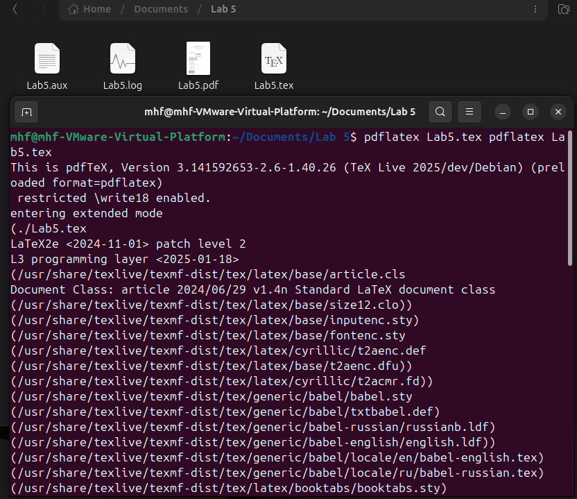

---
# Front matter
lang: ru-RU
title: "Лабораторная работа №5"
subtitle: "Компьютерный практикум по научному письму"
author: "Мохаммадхоссейн Фарзанфар"
institute: "РУДН"

# Formatting
toc: true
toc-depth: 2
numbersections: true
fontsize: 12pt
linestretch: 1.5
papersize: a4
documentclass: article
geometry: "left=2cm,right=2cm,top=2cm,bottom=2cm"
mainfont: "DejaVu Serif"
sansfont: "DejaVu Sans"
monofont: "DejaVu Sans Mono"
header-includes:
  - \usepackage{booktabs}
  - \usepackage{siunitx}
  - \usepackage{float}
  - \usepackage{fontspec}
  - \usepackage{polyglossia}
  - \setmainlanguage{russian}
  - \setotherlanguage{english}
---
# Лабораторная работа №5
**Тема: Работа с таблицами в LaTeX** 


## Цель работы

Освоить работу с таблицами в LaTeX: создание базовых таблиц, использование различных выравниваний, объединение ячеек, работа с пакетами `array`, `booktabs`, `siunitx`.


## Задание

Выполнить упражнения из раздела 5.14:

Выполнить упражнения из раздела 5.14:
1. Создать базовую таблицу
2. Использовать различные выравнивания колонок (`l`, `c`, `r`)
3. Протестировать структуру таблицы (слишком мало/много элементов)
4. Экспериментировать с командой `\multicolumn` для объединения ячеек
5. Создать профессиональную таблицу с использованием `booktabs`


## Теоретическая часть

### Основные пакеты для работы с таблицами

- **array** - расширенная функциональность для таблиц
- **booktabs** - профессиональное оформление таблиц
- **siunitx** - выравнивание числовых данных


### Команды booktabs
- `\toprule` - верхняя линия таблицы
- `\midrule` - средние разделители
- `\bottomrule` - нижняя линия таблицы
- `\cmidrule` - частичные горизонтальные линии

## Выполнение лабораторной работы

### 1. Создание документа и кода

Был создан файл `Lab5.tex` с реализацией всех упражнений из раздела 5.14.

{ width=70% }

{ width=70% }

### 2. Компиляция документа

Документ скомпилирован с помощью команды:
```bash

pdflatex Lab5.tex

```
{ width=70% }

### 3. Результаты выполнения упражнений

#### Упражнение 1: Базовая таблица

{ width=70% }

*Рисунок 1: Базовая таблица с использованием booktabs*

Создана простая таблица с тремя колонками, использующая профессиональное оформление через пакет `booktabs`.

#### Упражнение 2: Различные выравнивания колонок

{ width=70% }

*Рисунок 2: Таблица с разными типами выравнивания*

Продемонстрированы три типа выравнивания:
- `l` - выравнивание по левому краю
- `c` - выравнивание по центру
- `r` - выравнивание по правому краю

#### Упражнение 3: Тестирование структуры таблицы


**Слишком мало элементов:**
```
% Вызывает ошибку компиляции
% \begin{tabular}{ccc}
% A & B & C \\
% X & Y     % Отсутствует третий элемент
% \end{tabular}
```

**Результат:** LaTeX выдает ошибку "Extra alignment tab has been changed to `\cr`"

```
% Вызывает ошибку компиляции  
% \begin{tabular}{cc}
% 1 & 2 & 3 & 4  % Слишком много элементов
% \end{tabular}
```

**Результат:** LaTeX выдает ошибку "Extra alignment tab has been changed to `\cr`"

#### Упражнение 4: Объединение ячеек с `\multicolumn`

{ width=70% }

*Рисунок 3: Объединение ячеек с помощью multicolumn*

Использована команда `\multicolumn` для:
- Объединения двух колонок
- Объединения всех четырех колонок
- Центрирования содержимого объединенных ячеек

#### Упражнение 5: Профессиональная таблица

{ width=70% }

*Рисунок 4: Профессиональная таблица с числовыми данными*

Создана таблица с:
- Чистым оформлением через `booktabs`
- Числовыми данными, корректно выровненными
- Отсутствием вертикальных линий для профессионального вида

## Выводы

В ходе лабораторной работы №5 были освоены следующие навыки:

1. **Создание базовых таблиц** в LaTeX с использованием окружения `tabular`
2. **Управление выравниванием** колонок с помощью спецификаторов `l`, `c`, `r`
3. **Понимание структуры таблиц** - важность соответствия количества элементов и объявленных колонок
4. **Объединение ячеек** с помощью команды `\multicolumn` для создания сложных табличных структур
5. **Профессиональное оформление** таблиц с использованием пакета `booktabs`
6. **Работа с числовыми данными** и их корректное выравнивание

Освоение работы с таблицами в LaTeX является важным навыком для подготовки научных публикаций и отчетов, так как таблицы широко используются для представления структурированных данных в академической среде. Пакет `booktabs` позволяет создавать эстетически приятные и профессионально выглядящие таблицы, соответствующие стандартам научных изданий.
