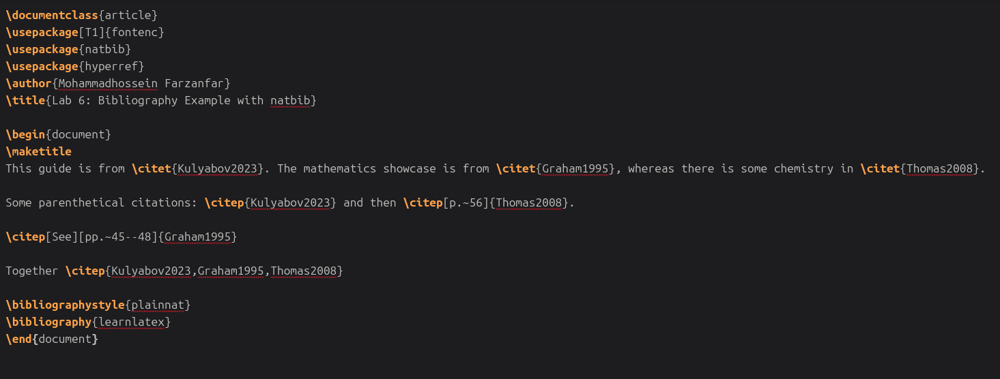
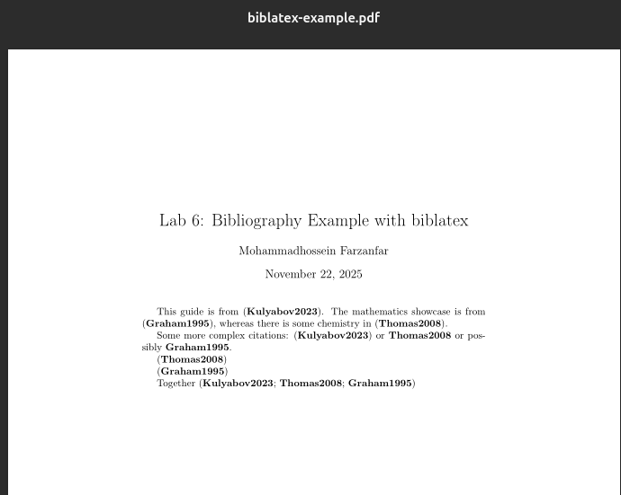
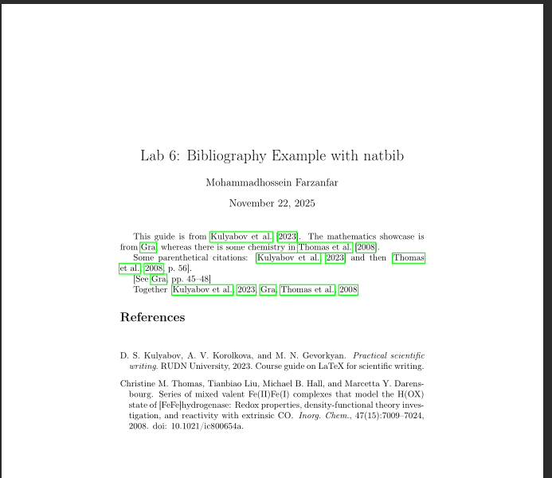
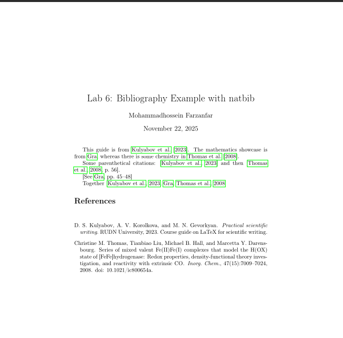

# Цель работы

Освоить работу с библиографией в LaTeX: использование natbib, biblatex, разные стили цитирования, добавление ссылок и управление базами данных.

# Задание

1. Попробовать примеры с natbib и biblatex.
2. Добавить новые записи в базу данных и новые цитаты.
3. Добавить цитату, которой нет в базе данных, и посмотреть, как она отображается.
4. Экспериментировать с numeric стилем natbib и biblatex.

# Теоретическая часть

## Базы данных ссылок

Базы данных ссылок обычно называются BibTeX-файлами с расширением .bib. Они содержат одну или несколько записей, каждая из которых представляет ссылку, с полями для информации.

## Передача информации из базы данных

Для передачи информации в документ есть три шага: компиляция LaTeX для создания файла ссылок, запуск BibTeX или Biber для обработки, повторная компиляция LaTeX.

## Рабочий процесс BibTeX с natbib

Natbib позволяет создавать разные типы цитат. Стили библиографии выбираются с помощью `\bibliographystyle`.

## Рабочий процесс biblatex

Biblatex работает иначе: базы данных выбираются в преамбуле, печать в теле документа. Стили задаются при загрузке пакета.

## Выбор между BibTeX и BibLaTeX

BibTeX проще для базовых нужд, biblatex лучше для сложных стилей и неанглийской сортировки.

# Выполнение лабораторной работы

## 1. Создание документа и кода

### Работа с natbib (Стили и цитаты)

:::::::::::::: {.columns}
::: {.column width="50%"}
**Исходный код natbib**
{width=100%}
:::
::: {.column width="50%"}
**Результат цитирования**
{width=100%}
:::
::::::::::::::

### Использование Numeric стиля в natbib

**Числовой стиль оформления ссылок**
{width=75%}

---

### Работа с пакетом biblatex

:::::::::::::: {.columns}
::: {.column width="50%"}
**Настройка biblatex**
{width=100%}
:::
::: {.column width="50%"}
**Финальный PDF**
{width=100%}
:::
::::::::::::::

---

### Обработка отсутствующих ссылок

:::::::::::::: {.columns}
::: {.column width="50%"}
**Несуществующий ключ**
{width=100%}
:::
::: {.column width="50%"}
**Отображение в тексте**
{width=100%}
:::
::::::::::::::
\vspace{0.3cm}
{width=60%}

---

### Добавление новой литературы в базу данных

**Редактирование файла .bib**
{width=85%}

---

### Результат добавления новой ссылки

:::::::::::::: {.columns}
::: {.column width="50%"}
**Цитата в тексте**
{width=100%}
:::
::: {.column width="50%"}
**Обновленный список**
{width=100%}
:::
::::::::::::::

# Выводы

В ходе лабораторной работы №6 были освоены следующие навыки:

1. **Создание баз ссылок** в BibTeX с использованием файлов .bib.
2. **Рабочий процесс с natbib** для автор-год стилей и numeric.
3. **Рабочий процесс с biblatex** для гибкого цитирования.
4. **Добавление и управление ссылками**, включая фальшивые и новые записи.
5. **Эксперименты со стилями** для разных типов цитирования.
\newpage
Освоение работы с библиографией в LaTeX является важным навыком для подготовки научных публикаций и отчетов, так как ссылки широко используются для представления источников в академической среде. Пакеты natbib и biblatex позволяют создавать профессиональные библиографии, соответствующие стандартам научных изданий.
