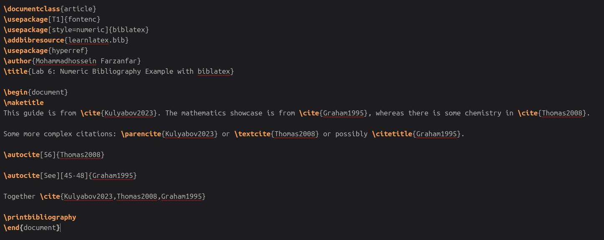
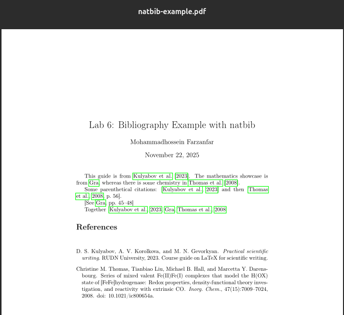
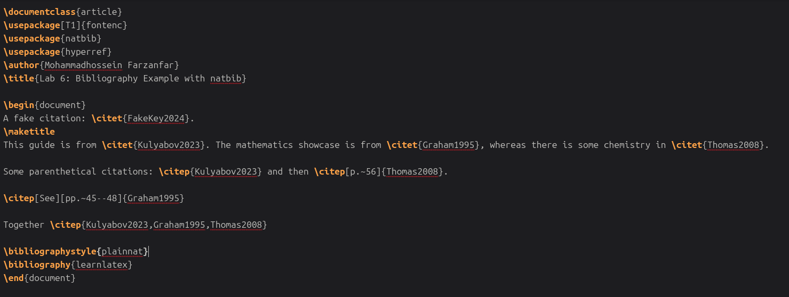
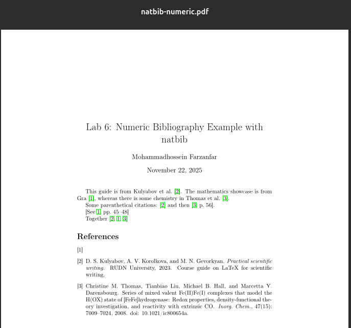
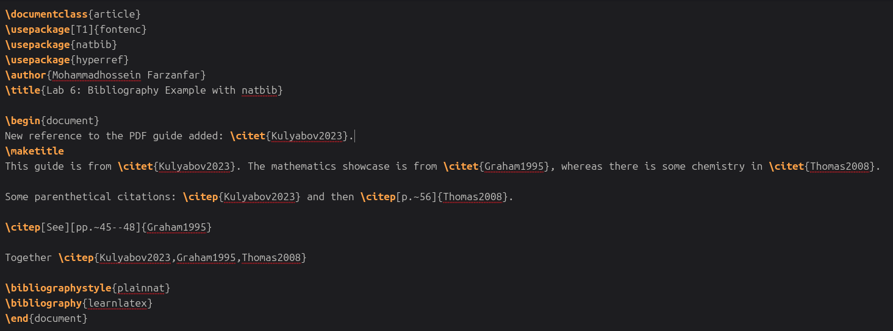
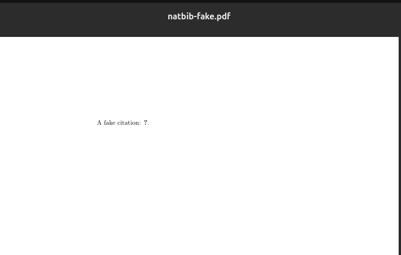
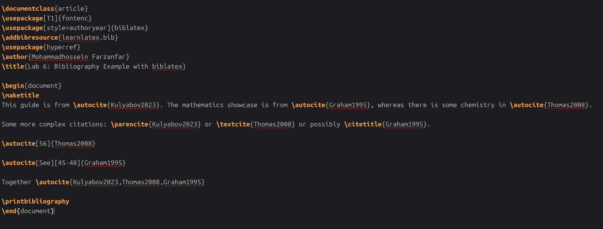
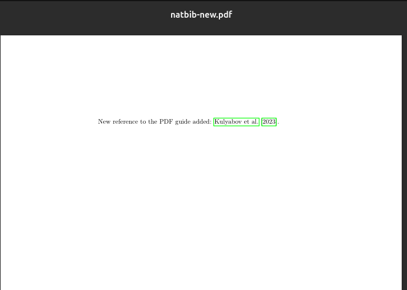

---
# Front matter
lang: ru-RU
title: "Лабораторная работа №6"
subtitle: "Компьютерный практикум по научному письму"
author: "Мохаммадхоссейн Фарзанфар"
institute: "РУДН"

# Formatting
toc: true
toc-depth: 2
numbersections: true
fontsize: 12pt
linestretch: 1.5
papersize: a4
documentclass: article
geometry: "left=2cm,right=2cm,top=2cm,bottom=2cm"
mainfont: "DejaVu Serif"
sansfont: "DejaVu Sans"
monofont: "DejaVu Sans Mono"
header-includes:
  - \usepackage{booktabs}
  - \usepackage{siunitx}
  - \usepackage{float}
  - \usepackage{fontspec}
  - \usepackage{polyglossia}
  - \setmainlanguage{russian}
  - \setotherlanguage{english}
---
# Лабораторная работа №6
**Тема: Работа с библиографией в LaTeX** 

## Цель работы

Освоить работу с библиографией в LaTeX: использование natbib, biblatex, разные стили цитирования, добавление ссылок и управление базами данных.

## Задание

Выполнить упражнения из раздела 6.9:

1. Попробовать примеры с natbib и biblatex.
2. Добавить новые записи в базу данных и новые цитаты.
3. Добавить цитату, которой нет в базе данных, и посмотреть, как она отображается.
4. Экспериментировать с numeric стилем natbib и biblatex.

## Теоретическая часть

### Базы данных ссылок

Базы данных ссылок обычно называются BibTeX-файлами с расширением .bib. Они содержат одну или несколько записей, каждая из которых представляет ссылку, с полями для информации.

### Передача информации из базы данных

Для передачи информации в документ есть три шага: компиляция LaTeX для создания файла ссылок, запуск BibTeX или Biber для обработки, повторная компиляция LaTeX.

### Рабочий процесс BibTeX с natbib

Natbib позволяет создавать разные типы цитат. Стили библиографии выбираются с помощью `\bibliographystyle`.

### Рабочий процесс biblatex

Biblatex работает иначе: базы данных выбираются в преамбуле, печать в теле документа. Стили задаются при загрузке пакета.

### Выбор между BibTeX и BibLaTeX

BibTeX проще для базовых нужд, biblatex лучше для сложных стилей и неанглийской сортировки.

## Выполнение лабораторной работы

### 1. Создание документа и кода

Был создан файл `Lab6.tex` с реализацией всех упражнений из раздела 6.9.

{ width=70% }

{ width=70% }

*Рисунок 1: Пример с natbib alphabetic*

{ width=70% }

{ width=70% }

*Рисунок 2: Пример с natbib numeric*

{ width=70% }

{ width=70% }

*Рисунок 3: Пример с biblatex*

{ width=70% }

{ width=70% }

{ width=70% }

*Рисунок 4: Фальшивая цитата в natbib*

{ width=70% }

{ width=70% }

{ width=70% }

*Рисунок 5: Новая ссылка в natbib*

## Выводы

В ходе лабораторной работы №6 были освоены следующие навыки:

1. **Создание баз ссылок** в BibTeX с использованием файлов .bib.
2. **Рабочий процесс с natbib** для автор-год стилей и numeric.
3. **Рабочий процесс с biblatex** для гибкого цитирования.
4. **Добавление и управление ссылками**, включая фальшивые и новые записи.
5. **Эксперименты со стилями** для разных типов цитирования.

Освоение работы с библиографией в LaTeX является важным навыком для подготовки научных публикаций и отчетов, так как ссылки широко используются для представления источников в академической среде. Пакеты natbib и biblatex позволяют создавать профессиональные библиографии, соответствующие стандартам научных изданий.
