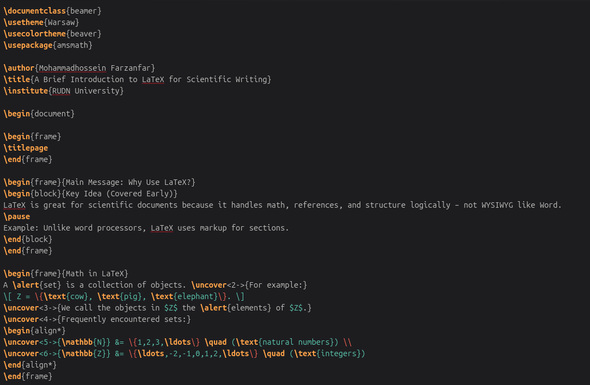
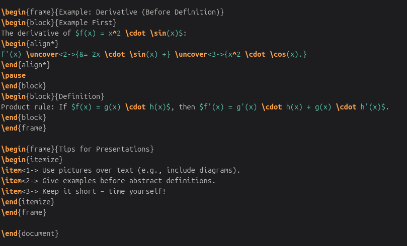

# Цель работы

Освоить создание научных презентаций и постеров в LaTeX с использованием классов **beamer** и **beamerposter** (раздел 7 учебника).

# Задачи

- Создать презентацию в Beamer с темой, блоками, паузами, uncover и математическими формулами.
- Создать научный постер формата A0 с помощью beamerposter.
- Скомпилировать оба документа в PDF.
- Получить файлы DOCX и PPTX через pandoc.

# Выполнение работы: Презентация в Beamer

Создан файл `presentation.tex`. Использована тема **Warsaw** + цветовая схема **beaver**. 
В презентации реализованы все основные элементы из главы 7.1.

# Выполнение работы: Постер формата A0

Создан файл `poster.tex` с использованием пакета **beamerposter**. 
Добавлен параметр `[fragile]` для корректной работы `\verb`. 
Постер содержит три колонки, блоки, цветной заголовок и изображение.

# Компиляция и конвертация

Все файлы успешно скомпилированы и сконвертированы:

```
pdflatex presentation.tex      # → presentation.pdf
pdflatex poster.tex         # → poster.pdf

pandoc presentation.tex --mathml -o presentation.docx
pandoc presentation.tex -t pptx --mathml -o presentation.pptx

pandoc poster.tex --mathml -o poster.docx
pandoc poster.tex -t pptx --mathml -o poster.pptx
```
## 4. Использованные файлы

- `presentation.tex` — исходный код презентации
- `poster.tex` — исходный код постера
- `logo.jpg` — изображение для постера
- `cite.bib` — файл библиографии
- Папка `image07/` — скриншоты для отчёта

{ width=70% }

*Рисунок 5: Фрагмент кода presentation.tex (основная часть)*

{ width=70% }

*Рисунок 6: Фрагмент кода presentation.tex (математика и советы)*

{ width=70% }

*Рисунок 7: Фрагмент кода poster.tex (основная часть)*

{ width=70% }

*Рисунок 8: Фрагмент кода poster.tex (продолжение)*

## Выводы

В ходе лабораторной работы №7 были освоены навыки создания презентаций и постеров в LaTeX. Beamer позволяет делать динамичные слайды, а beamerposter — большие визуальные материалы. Конвертация в офисные форматы через pandoc удобна.
