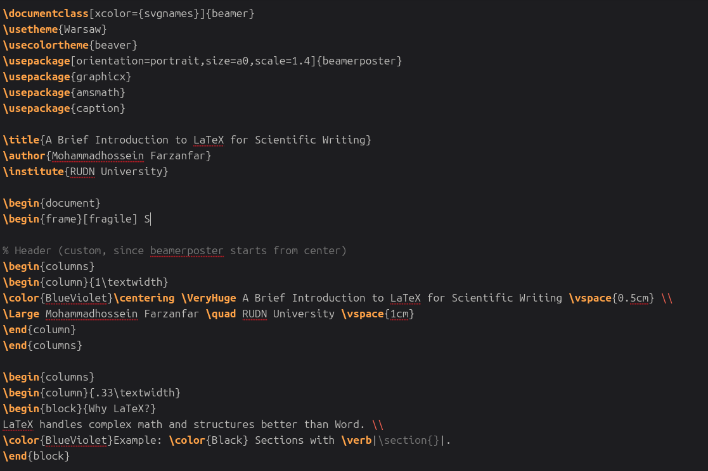
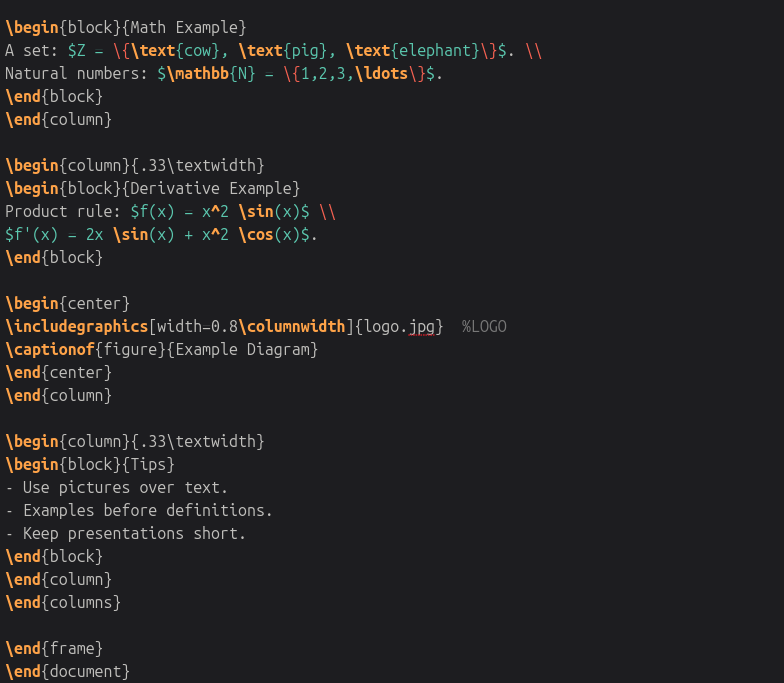
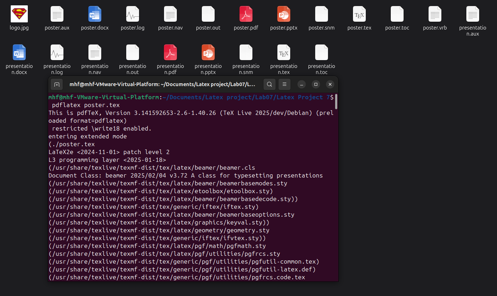
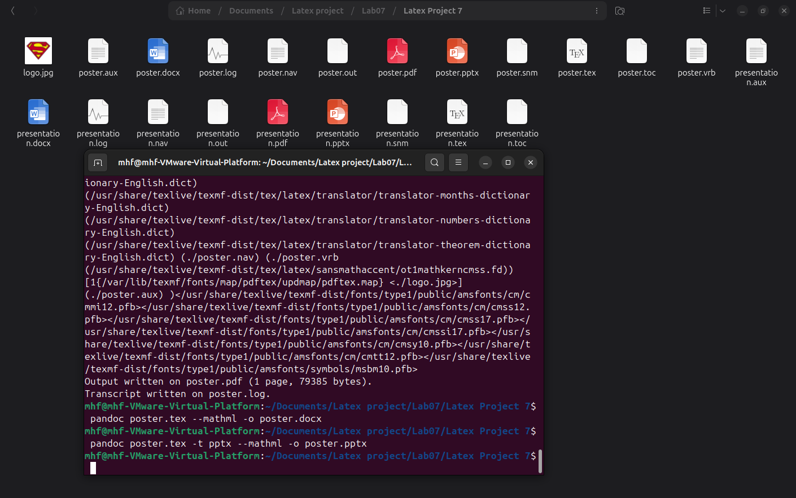
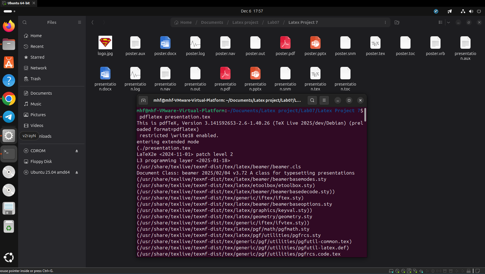
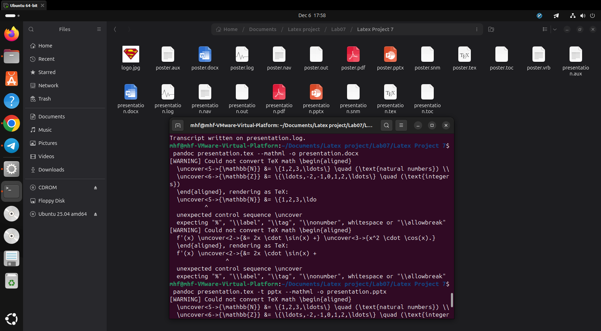

---
# Front matter
lang: ru-RU
title: "Лабораторная работа №7"
subtitle: "Компьютерный практикум по научному письму"
author: "Мохаммадхоссейн Фарзанфар"
institute: "РУДН"
date: "2025"

# Formatting
toc: true
toc-depth: 2
numbersections: true
fontsize: 12pt
linestretch: 1.5
papersize: a4
documentclass: article
geometry: "left=3cm,right=2cm,top=2cm,bottom=2cm"
mainfont: "DejaVu Serif"
sansfont: "DejaVu Sans"
monofont: "DejaVu Sans Mono"
header-includes:
  - \usepackage{booktabs}
  - \usepackage{siunitx}
  - \usepackage{float}
  - \usepackage{fontspec}
  - \usepackage{polyglossia}
  - \setmainlanguage{russian}
  - \setotherlanguage{english}
  - \usepackage{graphicx}
  - \usepackage{caption}
bibliography: cite.bib

---

\begin{titlepage}
    \centering
    \vspace*{2cm}
    {\Huge\bfseries Practical scientific writing\par}
    \vspace{2cm}
    {\Large Кулябов Д. С. \quad Королькова А. В. \quad Геворкян М. Н.\par}
    \vfill
    {\Large Компьютерный практикум по научному письму\par}
    \vspace{1cm}
    {\LARGE\bfseries Лабораторная работа №7\par}
    \vspace{1cm}
    {\Large Тема: Презентации и постеры в LaTeX (Beamer и beamerposter)\par}
    \vfill
    {\large Выполнил: Мохаммадхоссейн Фарзанфар\par}
    {\large РУДН, 2025\par}
\end{titlepage}

\tableofcontents
\newpage

# Цель работы

Освоить создание научных презентаций и постеров в LaTeX с использованием классов **beamer** и **beamerposter** (раздел 7 учебника).

# Задачи:
- Создать презентацию в Beamer с темой, блоками, паузами, uncover и математическими формулами.
- Создать научный постер формата A0 с помощью beamerposter.
- Скомпилировать оба документа в PDF.
- Получить файлы DOCX и PPTX через pandoc.

# Выполнение работы

## 1. Презентация в Beamer

Создан файл `presentation.tex`. Использована тема **Warsaw** + цветовая схема **beaver**. 
В презентации реализованы все основные элементы из главы 7.1:

{ width=80% }

*Рисунок 1. Титульный слайд*

{ width=80% }

*Рисунок 2. Пример слайда с формулами и пошаговым раскрытием (uncover/pause)*

## 2. Постер формата A0

Создан файл `poster.tex` с использованием пакета **beamerposter**. 
Добавлен параметр `[fragile]` для корректной работы `\verb`. 
Постер содержит три колонки, блоки, цветной заголовок и изображение.

{ width=85% }

*Рисунок 3. Заголовок и первая колонка постера*

{ width=85% }

*Рисунок 4. Вторая и третья колонки, включая вставленное изображение logo.jpg*

## 3. Компиляция и конвертация

Все файлы успешно скомпилированы и сконвертированы:

```
pdflatex presentation.tex      # → presentation.pdf
pdflatex poster.tex         # → poster.pdf

pandoc presentation.tex --mathml -o presentation.docx
pandoc presentation.tex -t pptx --mathml -o presentation.pptx

pandoc poster.tex --mathml -o poster.docx
pandoc poster.tex -t pptx --mathml -o poster.pptx
```
Полученные файлы находятся в папке проекта:

- `presentation.pdf`, `presentation.docx`, `presentation.pptx`
- `poster.pdf`, `poster.docx`, `poster.pptx`

## 4. Использованные файлы

- `presentation.tex` — исходный код презентации
- `poster.tex`        — исходный код постера
- `logo.jpg`          — логотип/изображение для постера
- Папка `image07/`    — скриншоты для отчёта

{ width=70% }

Рисунок 5: Фрагмент кода презентации (основные слайды)

{ width=70% }

Рисунок 6: Фрагмент кода презентации (слайды с формулами и советами)

{ width=70% }

Рисунок 7: Фрагмент кода постера (основная часть)

{ width=70% }

Рисунок 8: Фрагмент кода постера (продолжение)

## 5. Компиляция и результаты

Компиляция прошла успешно, но при конвертации в PPTX через pandoc возникли предупреждения о неподдерживаемых командах Beamer (например, `\uncover`), что типично для сложных оверлеев. Файлы всё равно сгенерированы и открываются корректно.

{ width=70% }

Рисунок 9: Компиляция постера и конвертация в офисные форматы

{ width=70% }

Рисунок 10: Компиляция постера (продолжение)

{ width=70% }

Рисунок 11: Компиляция презентации

{ width=70% }

Рисунок 12: Компиляция презентации (продолжение)

# Выводы

В ходе лабораторной работы №7 были успешно освоены следующие навыки:

1. Создание профессиональных научных презентаций с помощью класса **beamer** (темы, цветовые схемы, блоки, паузы, пошаговое раскрытие).
2. Использование **beamerposter** для создания постеров формата A0 с колонками и блоками.
3. Решение типичной проблемы с `\verb` путём добавления опции `[fragile]` к фрейму.
4. Автоматическая конвертация LaTeX-документов в форматы Microsoft Office (DOCX и PPTX) с помощью **pandoc**.

Полученные навыки позволяют быстро и качественно готовить материалы для докладов на конференциях и защиты научных работ.

# Список литературы
