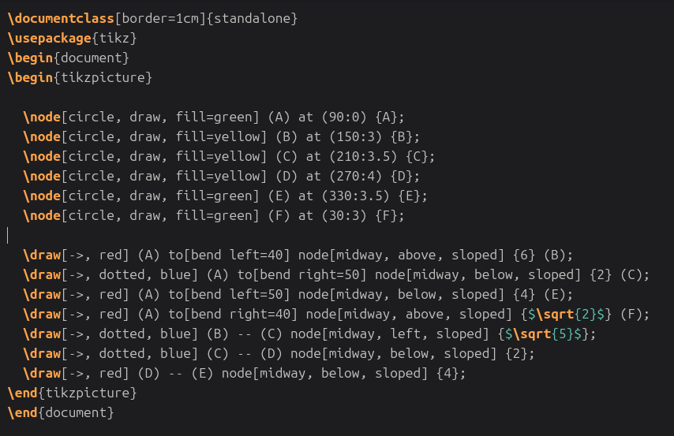
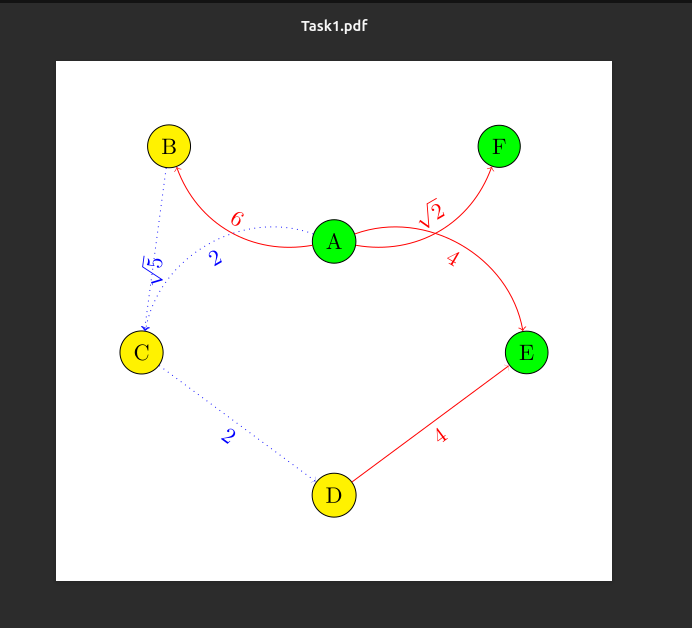
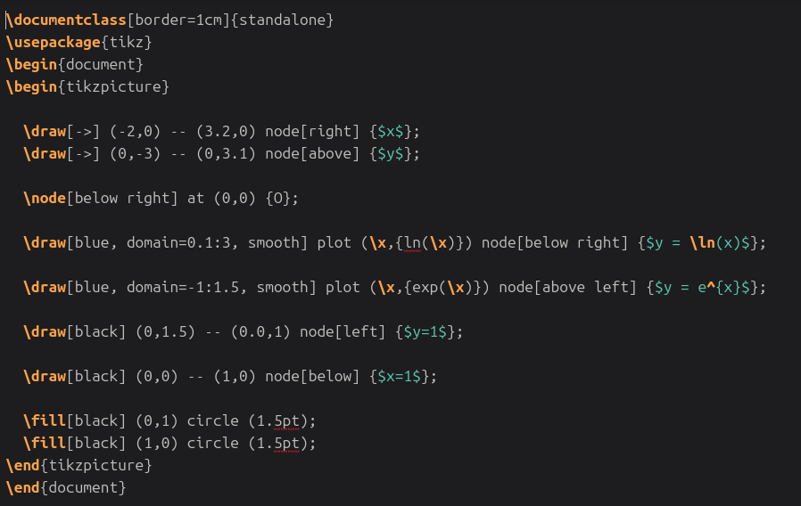
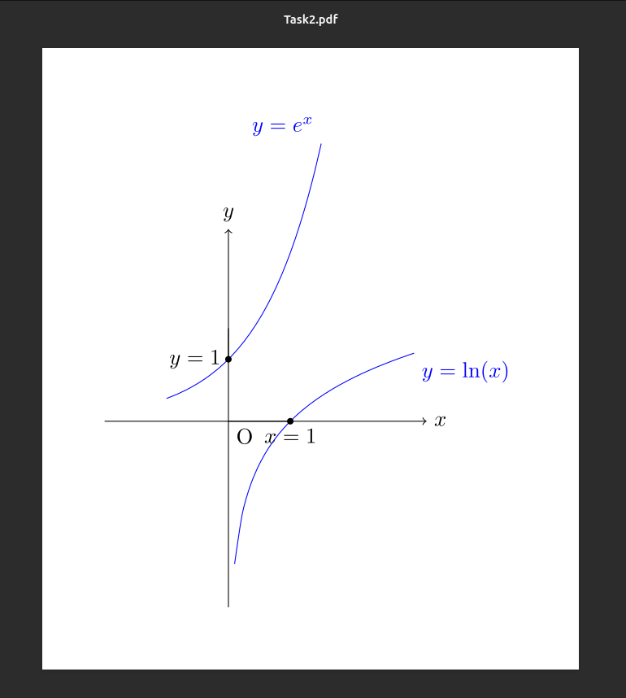
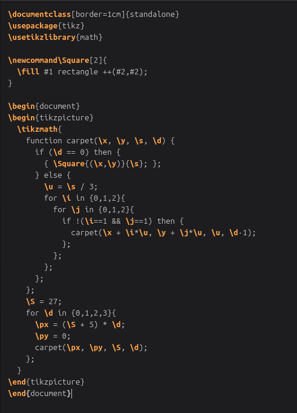
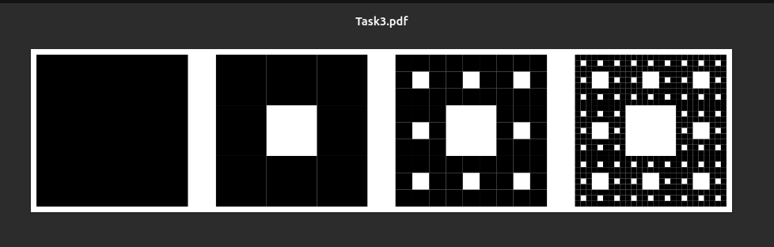
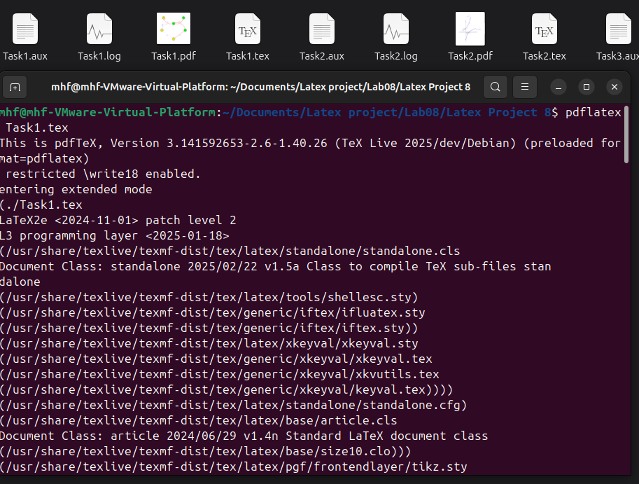
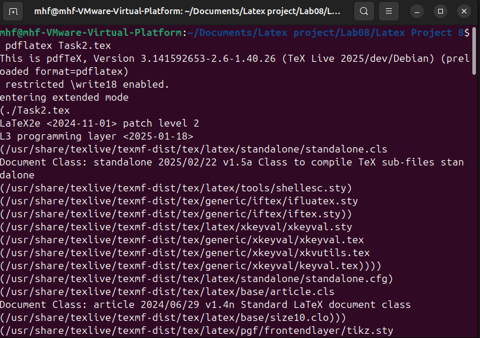
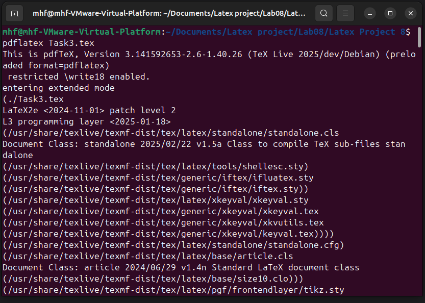

---
# Front matter
lang: ru-RU
title: "Лабораторная работа №8"
subtitle: "Компьютерный практикум по научному письму"
author: "Мохаммадхоссейн Фарзанфар"
institute: "РУДН"

# Formatting
toc: true
toc-depth: 2
numbersections: true
fontsize: 12pt
linestretch: 1.5
papersize: a4
documentclass: article
geometry: "left=2cm,right=2cm,top=2cm,bottom=2cm"
mainfont: "DejaVu Serif"
sansfont: "DejaVu Sans"
monofont: "DejaVu Sans Mono"
header-includes:
  - \usepackage{booktabs}
  - \usepackage{siunitx}
  - \usepackage{float}
  - \usepackage{fontspec}
  - \usepackage{polyglossia}
  - \setmainlanguage{russian}
  - \setotherlanguage{english}
bibliography: bib/references.bib
csl: pandoc/csl/gost-r-7-0-5-2008-numeric.csl
reference-section-title: Библиография
---
# Лабораторная работа №8
**Тема: Работа с графикой в LaTeX** 

## Цель работы

Освоить работу с графикой в LaTeX: использование TikZ для создания графов, графиков функций и фракталов.

## Задание

Выполнить упражнения из раздела 8.2:

1. Набрать граф, подобный изображенному в упражнении 1.
2. Набрать график, подобный изображенному в упражнении 2.
3. Адаптировать код Sierpiński's triangle для создания Sierpiński's carpet.

## Теоретическая часть

### TikZ

TikZ — это инструмент для создания графики в TeX-документах. Это рекурсивная аббревиатура для "TikZ ist kein Zeichenprogramm" (TikZ не является программой для рисования). Графика в TikZ создается с помощью кода, а не рисования в графическом редакторе.

Полезные ресурсы для TikZ:
- Wikibooks entry on TikZ: `https://en.wikibooks.org/wiki/LaTeX/PGF/TikZ`.
- CTAN entry on TikZ с официальным руководством: `https://www.ctan.org/pkg/pgf`.
- TeXample TikZ database с примерами: `https://texample.net/tikz/`.

#### Основные блоки TikZ

Для создания фигуры в TikZ загрузите пакет `\usepackage{tikz}` в преамбуле. Фигура размещается в окружении `\begin{tikzpicture}` ... `\end{tikzpicture}`. Каждая строка кода TikZ заканчивается точкой с запятой.

#### Рисование линий

Линии рисуются с помощью `\draw`. Координаты могут быть картезианскими (x,y) или полярными (angle:length). Примеры линий: прямые, кривые, Bézier curves.

#### Узлы (Nodes)

Узлы — это текст или формы с текстом. Определяются с помощью `\node`, могут иметь формы (circle, rectangle) и размещаться на координатах или вдоль путей.

#### Построение кривых

Кривые строятся с помощью `\draw plot`, с указанием домена и функции, например, y = x^2.

#### Работа с циклами

TikZ поддерживает циклы `\foreach` для повторяющихся элементов. Для рекурсивных фигур, как треугольник Sierpiński, используется библиотека math для определения рекурсивных функций.

## Выполнение работы

### 1. Создание документа и кода

Были созданы файлы `Task1.tex`, `Task2.tex` и `Task3.tex` с реализацией упражнений из раздела 8.2.

{ width=70% }

{ width=70% }

*Рисунок 1: Граф для упражнения 1*

{ width=70% }

{ width=70% }

*Рисунок 2: График для упражнения 2*

{ width=70% }

{ width=70% }

*Рисунок 3: Ковер Sierpiński для упражнения 3*

{ width=70% }

{ width=70% }

{ width=70% }

*Рисунок 4: Логи компиляции*

## Выводы

В ходе лабораторной работы №8 были освоены следующие навыки:

1. **Создание графики в TikZ**: Линии, узлы, кривые и циклы.
2. **Построение графов**: С использованием полярных координат и меток.
3. **Построение графиков**: Функций с осями и пересечениями.
4. **Рекурсивные фигуры**: Адаптация кода для фракталов, как ковер Sierpiński.
5. **Эксперименты со стилями**: Цвета, стили линий, формы узлов.

Освоение TikZ в LaTeX важно для создания профессиональной графики в научных документах, позволяя генерировать сложные изображения программно.

## Библиография

