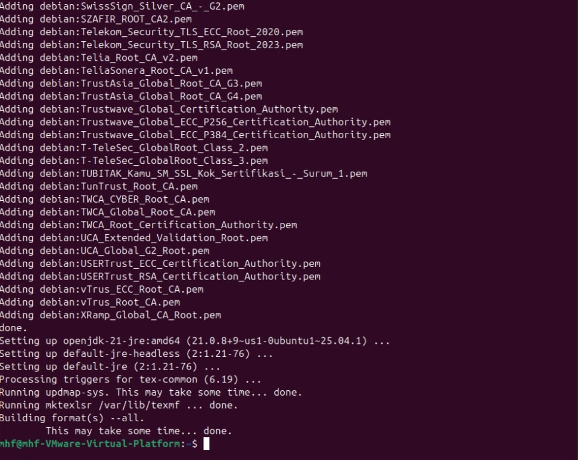
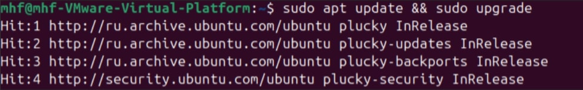

---
## Front matter
lang: ru-RU
title:  лабораторной работе №1
author: Мохаммадхоссейн Фарзанфар
institute: РУДН, Москва, Россия

date: 25 Сентября 2025

## Formatting
toc: false
slide_level: 2
theme: metropolis
header-includes: 
 - \metroset{progressbar=frametitle,sectionpage=progressbar,numbering=fraction}
 - '\makeatletter'
 - '\beamer@ignorenonframefalse'
 - '\makeatother'
aspectratio: 43
section-titles: true
---

## Цель работы

1. Познакомиться с основами работы в LaTeX.
2. Освоить установку дистрибутива TeXlive.

## Общая информация о TeXlive

- TeX Live — наиболее полный дистрибутив LaTeX
- Поддерживает множество операционных систем
- Разрабатывается с 1996 года
- Основная страница: https://www.tug.org/texlive/
- TeX Live — дистрибутив с непрерывными обновлениями

## Установка TeXlive

- Установка TeXlive через пакетный менеджер apt в системе Ubuntu
- Команда установки: `sudo apt install texlive-full`
- Система автоматически загрузила и установила все необходимые пакеты
- Процесс занял несколько часов

{ width=100% }

## Проверка актуальности версии

- Проверка версии системы: `pdflatex --version`
- Установлена версия TeX Live 2025 (последняя доступная)
- Необходимость в обновлении отсутствует
- Система готова к работе

{ width=59% }

## Выводы

В ходе лабораторной работы была изучена базовая информация о дистрибутиве TeXlive и освоены основные способы его установки. Были получены знания о процессе обновления дистрибутива, что является важным для поддержания актуальной версии LaTeX.
