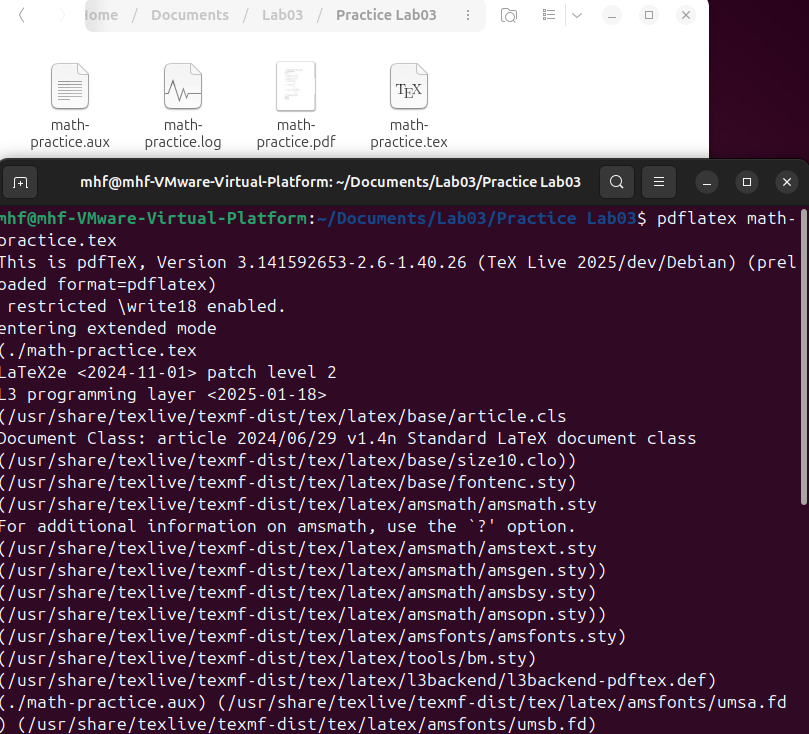

## Цель работы

Освоить набор математических формул в LaTeX, изучить математические режимы и работу с пакетами для математической верстки.

## Задание

1. Изучить математические режимы LaTeX
2. Освоить верхние и нижние индексы
3. Изучить греческие буквы и функции
4. Научиться работать с уравнениями и матрицами
5. Выполнить практические упражнения

## Основные математические режимы

**Два основных режима:**
- Инлайн-режим: `$y = mx + c$`
- Дисплей-режим: `\[ y = mx + c \]`

{ width=50% }

## Создание основного документа
Создал файл `math-practice.tex` с математическими конструкциями:

- Верхние и нижние индексы
- Греческие буквы
- Интегралы и уравнения
- Матрицы и шрифты

{ width=50% }

## Компиляция документа
Процесс компиляции основного документа:

```bash
pdflatex math-practice.tex
```
Результат - успешная компиляция без ошибок

{ width=70% }

## Практические упражнения
Создал файл exercises.tex с 4 упражнениями:

Сравнение инлайн и дисплей режимов

Практика с греческими буквами

Исследование шрифтов

Опции документа

{ width=70% }

## Компиляция упражнений
Выполнил компиляцию упражнений:
```bash
pdflatex exercises.tex
```
{ width=70% }

## Изученные математические элементы
Изученные математические элементы
Основные элементы:

Верхние/нижние индексы: $x^2$, $a_n$

Греческие буквы: $\alpha$, $\beta$, $\Gamma$

Функции: $\sin\theta$, $\log x$

Интегралы: $\int e^{-x^2} dx$

Матрицы: pmatrix, bmatrix

Шрифты: $\mathbf{B}$, $\mathbb{R}$, $\mathrm{C}$

{ width=70% }

## Специальные математические команды
Изученные команды:

$\frac{a}{b}$ - дроби

$\sum$, $\prod$ - суммы и произведения

$\lim$, $\int$ - пределы и интегралы

\begin{align*} - выровненные уравнения

\begin{pmatrix} - матрицы

$\mathbf{A}$ - жирный шрифт

## Результаты работы
Достигнутые результаты:

Успешная компиляция обоих документов

Освоены все математические режимы

Изучены греческие буквы и функции

Практика с матрицами и уравнениями

Выполнены все 4 упражнения

{ width=70% }

## Выводы
В ходе лабораторной работы №3:

Освоены математические режимы LaTeX

Изучены команды для сложных формул

Практически применены знания

Успешно созданы документы с математикой

Получены навыки работы с пакетом amsmath

Система LaTeX доказала свою эффективность для научных публикаций.
